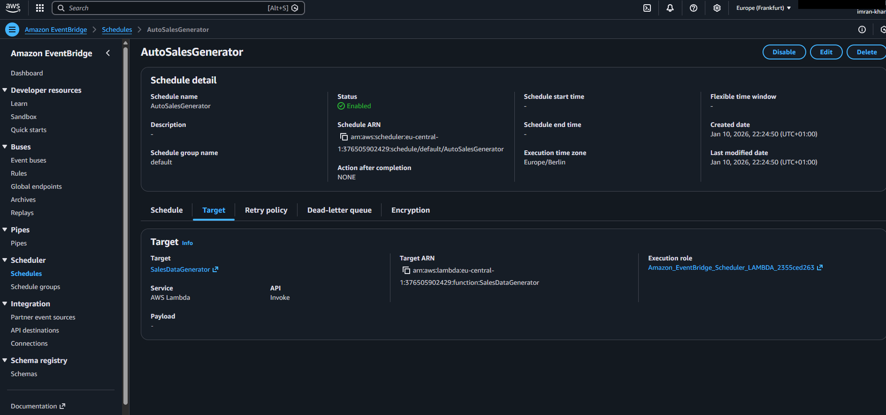
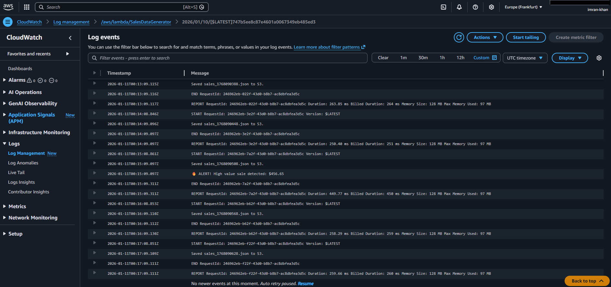
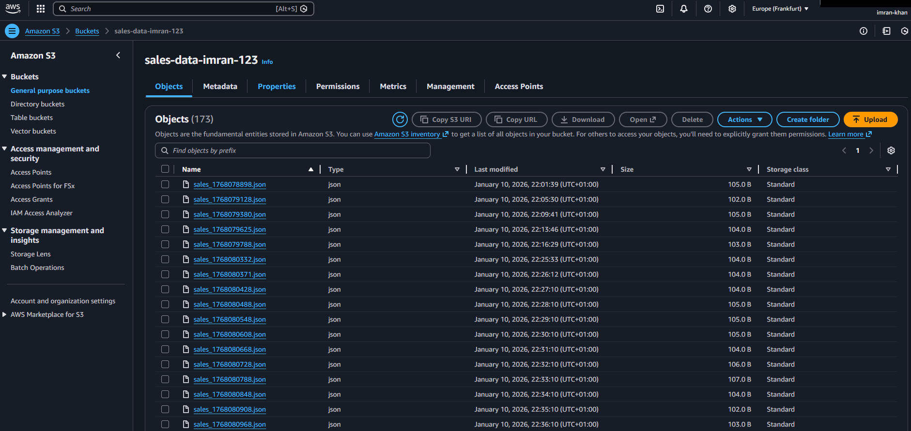
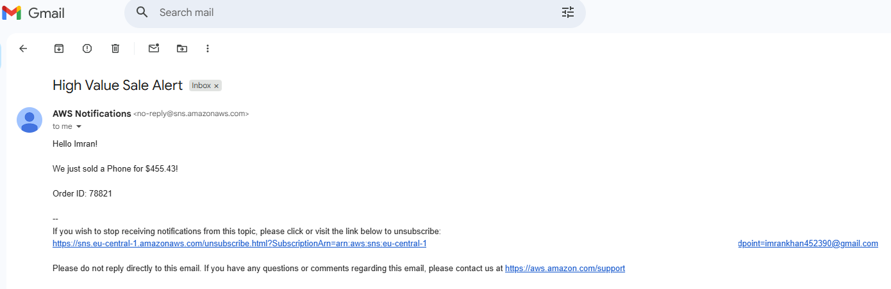

# AWS Serverless Sales Pipeline

## Project Overview
This project demonstrates a fully automated, event-driven data pipeline built on AWS. It is designed to ingest mock sales transaction data, store it for historical analysis, and process it in real-time to detect high-value transactions. When a transaction exceeds a specific threshold (e.g., $400), the system immediately triggers an email alert to stakeholders.

The goal of this project was to move from manual data checks to an automated "management by exception" workflow using serverless infrastructure.

## Architecture
The system utilizes a serverless architecture to ensure scalability and zero idle costs.

* **AWS Lambda (Python):** Contains the core logic for data generation, mock processing, and filtering.
* **Amazon EventBridge:** Configured as a scheduler to trigger the Lambda function every 60 seconds, simulating a continuous stream of sales data.
* **Amazon S3:** Acts as the data lake, storing every transaction record as a JSON file for audit trails and future analytics.
* **Amazon SNS (Simple Notification Service):** Handles the delivery of email alerts when business logic criteria are met.

## Implementation Steps & Evidence

### 1. Automation Setup
To simulate a production environment, Amazon EventBridge is configured with a rate-based schedule. This triggers the ingestion process automatically every minute without manual intervention.



### 2. Logic Verification & Monitoring
CloudWatch Logs provide the "heartbeat" of the system. The logs below confirm that the automation is running on schedule (every minute) and that the conditional logic correctly identifies high-value sales (e.g., the alert for $456.65).



### 3. Data Ingestion
All raw transaction data is successfully persisted to the S3 bucket. This ensures a complete historical record of all sales, regardless of their value.



### 4. Alerting System
When the high-value logic is triggered, Amazon SNS successfully delivers an email notification to the subscribed endpoint.



## Code Logic
The following Python snippet demonstrates the core filtering logic used in the Lambda function:

```python
    # Generate random price
    price = round(random.uniform(50, 500), 2)

    # Save to S3 (Data Lake)
    s3_client.put_object(
        Bucket=BUCKET_NAME,
        Key=file_name,
        Body=json.dumps(sale_data)
    )

    # Business Logic: Filter for High Value
    if price > 400:
        print(f"ALERT! High value sale detected: ${price}")
        sns_client.publish(
            TopicArn=TOPIC_ARN,
            Message=f"Hello! We just sold a {product} for ${price}!",
            Subject="High Value Sale Alert"
        )
